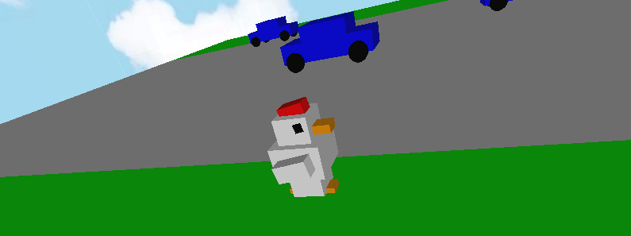

<div id="top"></div>

<!-- PROJECT SHIELDS -->
<!--
*** I'm using markdown "reference style" links for readability.
*** Reference links are enclosed in brackets [ ] instead of parentheses ( ).
*** See the bottom of this document for the declaration of the reference variables
*** for contributors-url, forks-url, etc. This is an optional, concise syntax you may use.
*** https://www.markdownguide.org/basic-syntax/#reference-style-links
-->

[![Contributors][contributors-shield]][contributors-url]
[![Forks][forks-shield]][forks-url]
[![Stargazers][stars-shield]][stars-url]
[![Issues][issues-shield]][issues-url]
[![MIT License][license-shield]][license-url]


<!-- PROJECT LOGO -->
<br />
<div align="center">
  <a https://github.com/Raul-Lopez-Cruz/CrossyRoad">
    
  </a>

  <h3 align="center">CrossyRoad</h3>
</div>


<!-- ABOUT THE PROJECT -->
## Acerca del proyecto

Se trata de un juego basado en el popular juego CrosyRoad, implementado en C y C++, con las tecnologías OpenGL y GLUT para el manejo de los gráficos 3D. 

<p align="right">(<a href="#top">Volver al principio</a>)</p>

### Creado con

* [C](https://www.learn-c.org/)
* [C++](https://isocpp.org/)
* [OpenGL](https://www.opengl.org/)
* [GLUT](https://www.opengl.org/resources/libraries/glut/glut_downloads.php)
* [Visual Studio Community](https://visualstudio.microsoft.com/es/vs/older-downloads/)
* [GitHub](https://github.com)

<p align="right">(<a href="#top">Volver al principio</a>)</p>


<!-- GETTING STARTED -->
## Comenzando

Este juego es un proyecto .sln, es decir, no se encuentra como un ejecutable standalone, es necesario contar con las librerías y programas correctos para su ejecución.

### Prerrequisitos

* Visual Studio Community
   ```sh
    disponible en https://visualstudio.microsoft.com/es/vs/older-downloads/
   ```
* Librerías y archivos .dll
  ```sh
    Se encuentran dentro del proyecto
  ```  

### Instalación

_Una vez que cuentas con el IDE Visual Studio Community..._

1. Clonar el repositorio o descargarlo en _Code >> Download ZIP_
   ```sh
   git clone https://github.com/Raul-Lopez-Cruz/CrossyRoad.git
   ```
2. Abre el proyecto en Visual Studio, haciendo doble click en la solución del proyecto: CrossyRoad.sln
3. Ejecuta el proyecto en modo "DEBUG" con la arquitectura x86 usando el Local Windows Debugger

<p align="right">(<a href="#top">Volver al principio</a>)</p>


<!-- USAGE EXAMPLES -->
## Cómo jugar
El juego tiene una mecánica sencilla: Ayudar a la gallina a cruzar la calle.
Ganas puntos cada vez que llegas al final del mapa.
Si eres arrollado por un auto, regresas al punto de salida.

### Controles
* Utiliza las teclas W, A, S, D para girar a la gallina.
* Usa la barra espaciadora para que la gallina salte hacia adelante.
* Haz click izquierdo y mueve el ratón para mover la cámara.
* Puedes ajustar el zoom haciendo click derecho y moviendo el mouse de arriba a abajo.

### Objetivo
* ¡El objetivo es reunir tantos puntos como puedas!

<p align="right">(<a href="#top">Volver al principio</a>)</p>


<!-- LICENSE -->
## Licencia

Publicado y distribuido bajo la licencia MIT. Consulta `LICENSE.txt` por más información.

<p align="right">(<a href="#top">Volver al principio</a>)</p>


<!-- CONTACT -->
## Autores

- [Raúl López](https://github.com/Raul-Lopez-Cruz)
- [Jaanai Martinez](https://github.com/jaanaip)
- [Omar Silverio](https://github.com/omarsilverio)

<p align="right">(<a href="#top">Volver al principio</a>)</p>


<!-- ACKNOWLEDGMENTS -->
## Fuentes, referencias y recursos

* [CrossyRoad](https://www.crossyroad.com/)
* [Learn OpenGL](https://learnopengl.com/)
* [GL programming](https://www.glprogramming.com/red/index.html)
* [Khronos.org](https://www.khronos.org/opengl/wiki/OpenGL_Type)
* [Jumpy Road by @mluder ](https://github.com/mluders/jumpy-road)
* [Readme guide by @othneildrew](https://github.com/othneildrew/Best-README-Template#contact)

<p align="right">(<a href="#top">Volver al principio</a>)</p>


<!-- MARKDOWN LINKS & IMAGES -->
<!-- https://www.markdownguide.org/basic-syntax/#reference-style-links -->
[contributors-shield]: https://img.shields.io/github/contributors/Raul-Lopez-Cruz/CrossyRoad.svg?style=for-the-badge
[contributors-url]: https://github.com/Raul-Lopez-Cruz/CrossyRoad/graphs/contributors
[forks-shield]: https://img.shields.io/github/forks/Raul-Lopez-Cruz/CrossyRoad.svg?style=for-the-badge
[forks-url]: https://github.com/Raul-Lopez-Cruz/CrossyRoad/network/members
[stars-shield]: https://img.shields.io/github/stars/Raul-Lopez-Cruz/CrossyRoad.svg?style=for-the-badge
[stars-url]: https://github.com/Raul-Lopez-Cruz/CrossyRoad/stargazers
[issues-shield]: https://img.shields.io/github/issues/Raul-Lopez-Cruz/CrossyRoad.svg?style=for-the-badge
[issues-url]: https://github.com/Raul-Lopez-Cruz/CrossyRoad/issues
[license-shield]: https://img.shields.io/github/license/Raul-Lopez-Cruz/CrossyRoad.svg?style=for-the-badge
[license-url]: https://github.com/othneildrew/Best-README-Template/blob/master/LICENSE.txt
